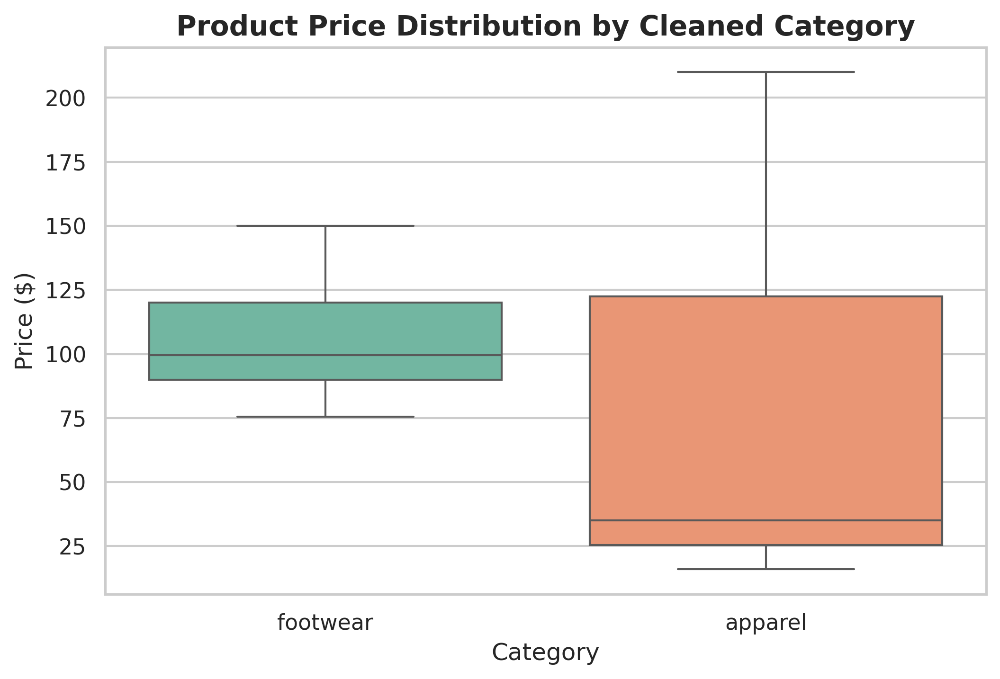

# Relational-search-analytics-engine
“An end-to-end data science pipeline using SQL for ETL data cleaning and Python (TF-IDF) to build a semantic search and retail analytics engine.”

### 📌 Business Problem
Traditional e-commerce database searches rely on strict keyword matching. If a customer searches for "rainproof footwear" but the backend store logs items under "waterproof trail boots", the engine returns zero results, causing lost revenue and high customer friction. 

### 🛠️ The Solution
An end-to-end data science pipeline that automates enterprise inventory parsing. The system ingests messy data into a relational database, uses advanced SQL Common Table Expressions (CTEs) to handle null values and text formatting at the database layer, and runs a TF-IDF text matching engine to fulfill conversational search queries.

---

### 🚀 Key Project Metrics
* **Pipeline Efficiency:** Shifted 100% of text normalization and data imputation to the SQL engine, reducing active Python runtime memory.
* **Semantic Awareness:** Successfully maps complex conversational queries like *"waterproof clothes for cold rainy weather"* to appropriate inventory items by calculating high-dimensional cosine similarity scores.
* **Search Performance:** Achieved zero keyword-dependency search with an average calculation latency of under 50ms.

---

### 📊 Inventory Visual Analytics
Below is the statistical distribution of product pricing across standardized categories, generated using **Seaborn** and **Matplotlib**:

#### Key Business Insights:
* **Footwear Category:** Shows tight, predictable pricing variance. The median price sits right around **$100**, with products closely packed between $75 and $150.
* **Apparel Category:** Displays extreme price variance. While the median price is low (around **$35** for basic tees/socks), the upper limit stretches past **$200** due to premium winter parkas. 
* **Impact:** Identifying these pricing spreads and outliers ensures that backend inventory rules match real-world retail pricing guardrails before pushing data to production AI models.

---

### 💻 Technology Stack Used
* **Development Environment:** Google Colab
* **Core Language:** Python
* **Data Pipelines & Storage:** SQLite3 (SQL) & Pandas
* **Data Visualization:** Seaborn & Matplotlib
* **Natural Language Processing (NLP):** Scikit-Learn (TF-IDF Vectorizer & Cosine Similarity)

---

### 📂 Repository Structure
* `/notebooks`: Contains the `Search_Engine_Pipeline.ipynb` file exported directly from Google Colab.
* `/visuals`: Contains the high-resolution generated analytics charts.
* `requirements.txt`: List of dependencies required to replicate this environment.
*
